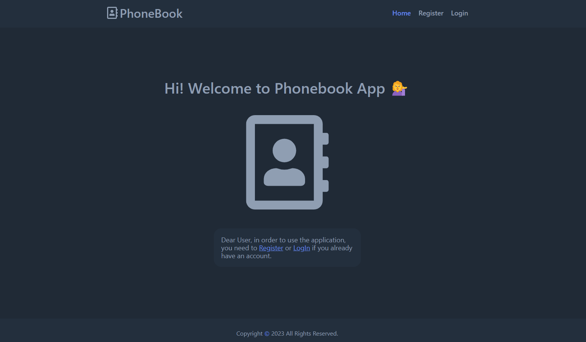

# 📞 Phonebook App :phone 

- **[View live page](https://denysborysiuk.github.io/phonebook/)**
- **[Backend code page](https://github.com/DenysBorysiuk/api-phonebook)**
---

## 🗂️ Project description 

This project is a Fullstack app that allows you to register a user and create a private collection of contacts.

Frontend built on React.
Backend is built on Node.js 
Database MongoDB

## Attention!!!

Backend deployed on Render.com as Free Web Services
Web Services on the free instance type are automatically spun down after 15 minutes of inactivity. When a new request for a free service comes in, Render spins it up again so it can process the request.
This will cause a delay in the response of the first request after a period of inactivity while the instance spins up.

## Features

- Implemented a backend using Node.js;
- Implemented saving users and contacts in the database MongoDB;
- Created a routing using React Router.

## Used libraries:

- React
- React-dom
- React-router-dom
- React-select
- React-spinners
- React-hot-toast
- Redux
- Emotion
- Axios

## 📂 Deployment

To deploy this project, you need to perform the following steps:

1. **Clone the repository**: Use the `git clone` command to clone this repository to your computer.
2. **Install the dependencies**: Open a terminal in the root of the project and run `npm install` or
   `yarn install` to install all required dependencies.
3. **Setting environment variables**: Create a `.env` file in the root folder and add the necessary
   environment variables that you need for the project according to the `.env.example` file.
4. **Run the application**: Run the `npm run dev` or `yarn dev` command to run the project on the
   local server.
5. **Deploy**: To deploy this project to a production server, use hosting platforms such as Vercel,
   Netlify, or others.
